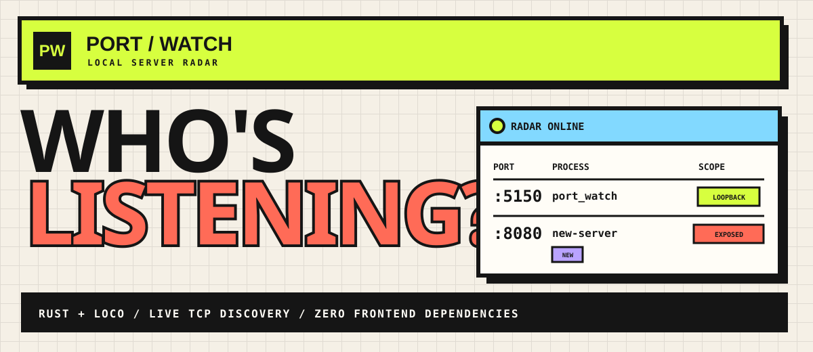

<div align="center">
  
</div>

<br>

<div align="center">
  <strong>A live, local-first map of every visible TCP listener on your machine.</strong><br>
  Built with Rust + Loco. No database. No frontend framework. No agent soup.
</div>

<br>

<div align="center">
  
  
  
  
</div>

## ◼ What it does

Port Watch scans the host for listening TCP sockets, enriches them with process metadata,
and redraws the dashboard every two seconds. When a server appears or disappears, the
activity tape calls it out immediately.

| **RADAR** | **PROCESS INTEL** | **UI** |
|:---|:---|:---|
| Detects new and closed listeners | PID, parent PID, user, command, executable | Neo-brutalist, responsive dashboard |
| Loopback vs network exposure | CPU, memory, start time, file descriptor | Search, scope filters, detail drawer |
| IPv4 + IPv6 deduplication | Probable HTTP URL when identifiable | Live arrival/departure tape |

> [!NOTE]
> Port Watch only reports processes the current OS user is allowed to inspect.

## ◼ Quick start

You need a current Rust toolchain plus the native `lsof` and `ps` commands.

```bash
git clone https://github.com/Pinaki93/PortWatch.git
cd port-watch
cargo loco start
```

Open **[localhost:5150](http://localhost:5150)**. To use another port:

```bash
PORT=5151 cargo loco start
```

## ◼ REST API

| Method | Route | Response |
|:---:|:---|:---|
| `GET` | `/api` | Application metadata and route index |
| `GET` | `/api/servers` | Current enriched listener snapshot |
| `GET` | `/_ping` | Loco liveness check |
| `GET` | `/_health` | Loco health check |
| `GET` | `/_readiness` | Loco readiness check |

```json
{
  "listener_count": 8,
  "process_count": 7,
  "exposed_count": 4,
  "servers": [
    {
      "process": "port_watch-cli",
      "pid": 59245,
      "address": "::1",
      "port": 5150,
      "scope": "loopback",
      "status": "listening"
    }
  ]
}
```

## ◼ How the signal moves

```text
┌──────────────┐     ┌──────────────────┐     ┌────────────────────┐
│ lsof sockets │ ──▶ │ Rust enrichment  │ ──▶ │ GET /api/servers   │
└──────────────┘     │ + batched ps     │     └─────────┬──────────┘
                     └──────────────────┘               │ every 2s
                                                        ▼
                                              ┌────────────────────┐
                                              │ Live dashboard     │
                                              │ + activity tape    │
                                              └────────────────────┘
```

The UI is a single embedded HTML file. Loco serves it and the JSON API from the same Rust
binary, so there is no Node toolchain or separate asset build.

## ◼ Development

```bash
cargo fmt --all
cargo clippy --all-targets -- -D warnings
cargo test
cargo loco routes
```

The parser test covers listener deduplication and scope classification; the request test
boots the real Loco app and verifies the dashboard and API.

## ◼ Project map

```text
assets/index.html          dashboard, styles, and live client
assets/readme-hero.svg     this README's neo-brutalist banner
src/controllers/home.rs   routes, socket scan, process enrichment
src/views/home.rs         API response types
tests/requests/home.rs    end-to-end request check
```

---

<div align="center">
  <strong>PORT / WATCH</strong><br>
  <sub>Know what's listening.</sub>
</div>
